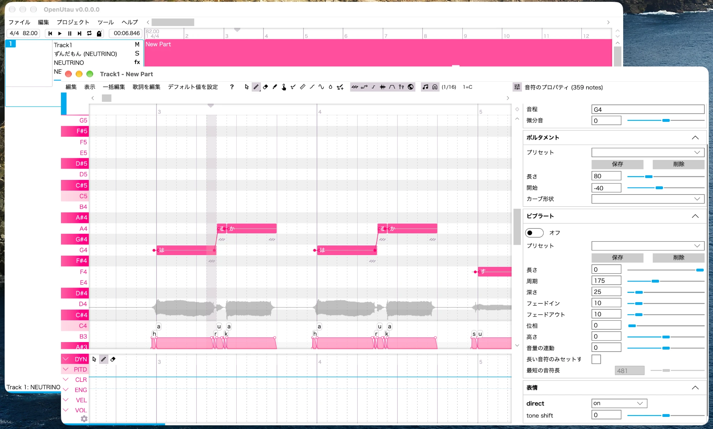

# OpenUtau NEUTRINO対応版(非公式)

歌声エディタ OpenUtau で、NEUTRINO の歌声(ずんだもん等)を歌わせられるようにしたものです。画面で音符・歌詞・音程のカーブ・ビブラートを直せます。



## ダウンロード

- **Mac**: [OpenUtau-NEUTRINO-macos-arm64.dmg](https://github.com/pika-02-03/OpenUtau-NEUTRINO/releases/latest/download/OpenUtau-NEUTRINO-macos-arm64.dmg)
- **Windows**: [OpenUtau-NEUTRINO-win-x64.zip](https://github.com/pika-02-03/OpenUtau-NEUTRINO/releases/latest/download/OpenUtau-NEUTRINO-win-x64.zip)(動作未確認)
- 過去の版: [Releases](https://github.com/pika-02-03/OpenUtau-NEUTRINO/releases)

## はじめに読んでください

- **NEUTRINO は別に用意が必要です。** これには入っていません。下の「必要なもの」を見て、先に公式サイトから入手してください。
- **最初は警告が出て開けません。** このビルドと NEUTRINO には、有料の「開発者の署名」が付いていないためです。Mac では「壊れているため開けません」「開発元を検証できません」、Windows では「Windows によって PC が保護されました」と出ます。下の手順どおりに進めれば解除できます。
- **非公式・無保証です。** 本家 OpenUtau・NEUTRINO の開発元とは関係ありません。使って起きた問題に、配布者は責任を負いません。自己責任で使ってください。
- **不具合の伝え先。** この配布物や登録スクリプトの問題は、本家へ問い合わせないでください。NEUTRINO 対応そのものの不具合や感想は、元の提案 [openutau/OpenUtau#2136](https://github.com/openutau/OpenUtau/pull/2136) へ伝えられます。その時は、この非公式ビルドで試したことと、下の「このビルドについて」にあるコミットを書き添えてください。
- **ライセンス・利用規約は本家に従います。** OpenUtau は本家の [MIT ライセンス](https://github.com/openutau/OpenUtau/blob/master/LICENSE.txt)、NEUTRINO は公式の [NEUTRINO 利用許諾契約書](https://studio-neutrino.com/downloads/manual/EULA_NEUTRINO.pdf) と [歌声ライブラリ利用許諾契約書](https://studio-neutrino.com/downloads/manual/EURA_neutrino_singer_library.pdf)、キャラクターごとの決まりは公式の [ライセンス・ガイドライン](https://studio-neutrino.com/ufaq-category/license/) に従ってください。
- **OpenUtau の使い方**は本家の説明を見てください: [はじめかた (Getting Started)](https://github.com/openutau/OpenUtau/wiki/Getting-Started)、[よくある質問 (FAQ)](https://www.openutau.com/FAQ/)、[公式サイト](https://www.openutau.com/)。

## 必要なもの

| | Mac | Windows |
|---|---|---|
| パソコン | Apple Silicon (M1以降) | Windows 10 / 11 (64bit) |
| NEUTRINO 本体 | **Mac 版** v3.2以上(v4 は不可) | **Windows 版** v3.2以上(v4 は不可) |
| 歌声モデル | v3 用のモデルを NEUTRINO の `model` フォルダに入れたもの | 同じ |

- NEUTRINO は [公式サイト](https://studio-neutrino.com/) から入手し、説明どおりに展開してください。展開したフォルダに `bin`・`model`・`settings` があれば大丈夫です。
- GPU や Python などを追加で入れる必要はありません。
- 動作を確かめたのは Mac + NEUTRINO v3.2.2 + ずんだもんだけです。

## 導入方法

### Mac

1. **ダウンロード**: [Mac 用の dmg](https://github.com/pika-02-03/OpenUtau-NEUTRINO/releases/latest/download/OpenUtau-NEUTRINO-macos-arm64.dmg) と、[NEUTRINO 公式サイト](https://studio-neutrino.com/) から Mac 版の NEUTRINO と歌声モデルをダウンロードします。NEUTRINO は展開して、好きな場所に置きます。
2. **インストール**: dmg を開き、`OpenUtau.app` を隣の「Applications」へドラッグします。**まだ起動せず、dmg も開いたままにしておきます。**
3. **警告の解除と登録**: 「ターミナル」を開きます(Spotlight で「ターミナル」と検索)。次の1行を貼り付けて Enter を押します。
   ```
   bash /Volumes/OpenUtau-NEUTRINO/NEUTRINOを登録.command
   ```
   「NEUTRINO のフォルダをドラッグして」と出たら、NEUTRINO のフォルダをターミナルへドラッグして Enter を押します。これで OpenUtau と NEUTRINO の警告が解除され、歌声が登録されます。
4. **使う**: OpenUtau を起動します。トラックの歌手で「ZUNDAMON (NEUTRINO)」などを選び、音符と歌詞を入れて再生します。MusicXML はウィンドウへドラッグすれば読み込めます。

### Windows(動作未確認)

Windows 版は自動でビルドしているだけで、実際の Windows では試していません。

1. **ダウンロード**: [Windows 用の zip](https://github.com/pika-02-03/OpenUtau-NEUTRINO/releases/latest/download/OpenUtau-NEUTRINO-win-x64.zip) と、[NEUTRINO 公式サイト](https://studio-neutrino.com/) から Windows 版の NEUTRINO と歌声モデルをダウンロードします。
2. **ブロックの解除と展開**: ダウンロードした zip(このビルドと NEUTRINO の両方)を右クリックして「プロパティ」を開き、下の「許可する」にチェックを入れて OK を押します。そのあと右クリックして「すべて展開」します。
3. **登録**: 展開した OpenUtau のフォルダにある `register-neutrino.bat` をダブルクリックします。「PC が保護されました」と出たら「詳細情報」→「実行」を押します。NEUTRINO のフォルダをウィンドウへドラッグして Enter を押すと、歌声が登録されます。
4. **使う**: 同じフォルダの `OpenUtau.exe` を起動します。トラックの歌手で「ZUNDAMON (NEUTRINO)」などを選び、音符と歌詞を入れて再生します。

## 困ったとき

- **音程が定規で引いたように平ら**: 普通に1回再生したあと、音符を全部選び、「ノート」メニューの「レンダリング済みピッチの読み込み」を押します。NEUTRINO 本来の自然な音程になり、その上からしゃくりやビブラートを手で足せます。音符や歌詞を変えたら、その部分だけもう一度読み込みます。
- **Mac で警告が出て開けない**: 手順3の1行をもう一度実行します。それでも開けない時は、「システム設定」→「プライバシーとセキュリティ」を開き、下の方にある「このまま開く」を押します。
- **Mac でモデルを足した・消した**: 手順3の1行をもう一度実行し、OpenUtau を起動し直します。
- **Mac で登録を外したい**: dmg を開いてターミナルで次の1行を実行します。登録で作ったものだけを消し、NEUTRINO と作った作品は消しません。アプリ本体は `OpenUtau.app` をゴミ箱へ入れれば消えます。
  ```
  bash /Volumes/OpenUtau-NEUTRINO/NEUTRINOの登録を解除.command
  ```
- **Windows で警告が出て開けない**: 「詳細情報」→「実行」を押します。毎回出る時は、手順2のブロックの解除をしてから展開し直します。
- **Windows でモデルを足した・消した**: `register-neutrino.bat` をもう一度実行し、OpenUtau を起動し直します。
- **Windows で登録を外したい**: `unregister-neutrino.bat` をダブルクリックします。登録で作ったものだけを消し、NEUTRINO は消しません。そのあと OpenUtau のフォルダごと削除すれば、すべて消えます。

## このビルドについて

- 中身は、本家へ出ている NEUTRINO 対応の提案 [openutau/OpenUtau#2136](https://github.com/openutau/OpenUtau/pull/2136)(作者 rokujyushi さん、まだ本家に入っていません)です。rokujyushi/OpenUtau の `neutrino` ブランチ、コミット [`203c44f5`](https://github.com/rokujyushi/OpenUtau/commit/203c44f5d1374697abfa69626a2b52a19627184b)(2026-09-13)をそのままビルドしています。
- 変えたのはアプリの「更新の確認」だけです。本家版(NEUTRINO 非対応)に上書きされないよう、確認先をこの配布元にしています。
- 登録スクリプトは、NEUTRINO の中身を変えません。警告の印を外し、OpenUtau の設定フォルダにリンクと歌手の設定を置くだけです。
- ライセンスと利用規約は本家に準拠します。OpenUtau 部分は本家と同じ [MIT ライセンス](https://github.com/openutau/OpenUtau/blob/master/LICENSE.txt)です。NEUTRINO 本体と歌声モデルはこの配布物に含まれず、公式の規約([NEUTRINO](https://studio-neutrino.com/downloads/manual/EULA_NEUTRINO.pdf)・[歌声ライブラリ](https://studio-neutrino.com/downloads/manual/EURA_neutrino_singer_library.pdf)・[ライセンス・ガイドライン](https://studio-neutrino.com/ufaq-category/license/))に従います。
- 無保証です。このビルドやスクリプトを使って起きたいかなる問題(データが消えた、動かない、など)にも配布者は責任を負わず、問い合わせへの対応も約束しません。

## 自動更新の仕組み

- 毎朝6時(日本時間)に、元のブランチが更新されていないかを GitHub Actions が確かめます。更新されていれば Mac 版と Windows 版をビルドし、新しい Release を出します。
- 提案が本家に取り込まれたら、ビルドをやめ、本家の [Releases](https://github.com/openutau/OpenUtau/releases) への案内を出して止まります。
- このブランチ (`release-kit`) には配布用の設定だけがあります。説明文は [`packaging/`](packaging) の部品から、この README・Release の本文・同梱の説明書を組み立てています。最後に配布した版は [`state/last-build.json`](state/last-build.json) にあります。
